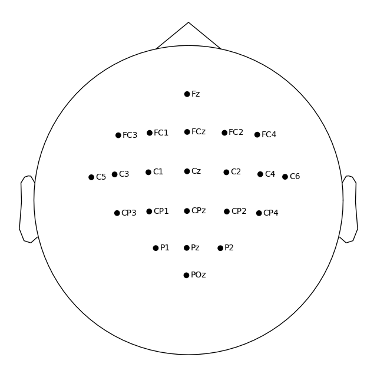

# 🧠 Neuro-Control: Motor Imagery BCI


**Neuro-Control** is an active Brain-Computer Interface (BCI) project designed to translate real-time neural signals into digital commands.

Unlike passive monitoring systems, this project focuses on **Motor Imagery (MI)**: detecting the user's intention to move (e.g., Left Hand vs. Right Hand) solely through EEG signals, enabling hands-free control of applications and games.

## 🎯 Objective
Build a low-latency pipeline to classify 4-class Motor Imagery signals using **Common Spatial Patterns (CSP)** and Deep Learning (**EEGNet**) to control a game environment (Pong/Minecraft).

## 📂 Dataset
**BCI Competition IV 2a** (Graz University)
- **Signals:** 22 EEG channels (10-20 system) + 3 EOG channels.
- **Tasks:** Left Hand, Right Hand, Feet, Tongue.
- **Sampling:** 250 Hz.

## 🛠 Tech Stack
- **Acquisition & Processing:** `MNE-Python`, `NumPy`, `SciPy`
- **Machine Learning:** `PyTorch` (EEGNet), `Scikit-Learn` (LDA)
- **DevOps:** `Docker`
- **Interface:** `PyGame` (Planned)

## 📸 Visualization
This project automatically maps the EEG channels to the standard 10-20 system.
Here is the sensor montage generated by the data loader:




## 🚀 Getting Started

### 1. Clone the repo
```bash
git clone [https://github.com/YOUR_USERNAME/motor-imagery-bci.git](https://github.com/YOUR_USERNAME/motor-imagery-bci.git)
cd motor-imagery-bci
```

### 2. Install the Dependencies
```bash
pip install -r requirements.txt
```

## 🏗 Project Structure
- `src/data_loader.py`: Handles GDF loading and channel renaming.
- `src/preprocessing.py`: (In Progress) Filters and epochs the data.