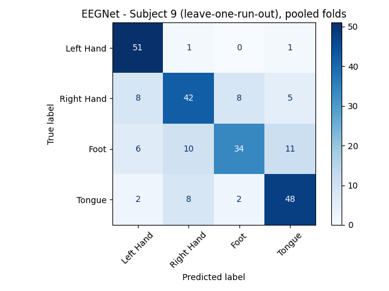
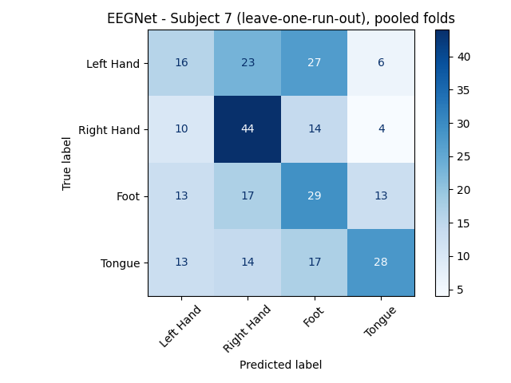
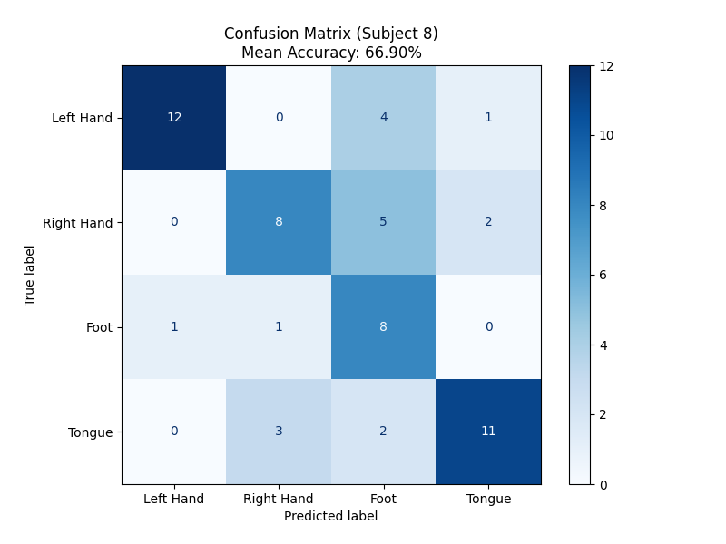

# 🧠 Motor Imagery BCI


-orange)

A 4-class motor imagery Brain-Computer Interface built on **BCI Competition IV
dataset 2a** (9 subjects, 22 EEG channels, 250 Hz). The pipeline decodes which
movement a subject is *imagining*, left hand, right hand, foot, or tongue, from
their EEG, and uses that prediction to move a player around a 2D grid game.

The project covers the full path end to end: raw GDF loading, two preprocessing
profiles, artifact rejection, a classical CSP+LDA baseline, an EEGNet
reimplementation, per-subject persisted models, and a PyGame interface that
replays trials through the trained model one turn at a time.

---

> ### ⚠️ This is a demo on recorded data, not a live BCI
>
> **There is no EEG hardware in the loop.** The game does not read a brain in real
> time. Each turn replays one 4-second trial that was recorded in 2008 for BCI
> Competition IV, pushes it through the trained model, and moves the player in the
> direction of the predicted class.
>
> In practice this means the game is an honest visualization of *classifier
> behavior*, not a control interface: it shows what the model would decide for
> real motor imagery data, including when it is wrong, but nobody is driving it
> by thinking. Turning this into a live BCI is listed under
> [Future work](#8-future-work).

---

## 1. Dataset

**BCI Competition IV dataset 2a** (Graz University of Technology; also mirrored by
BNCI Horizon 2020).

- **Subjects:** 9
- **Signals:** 22 EEG channels (10-20 system) + 3 EOG channels, 250 Hz
- **Classes:** Left Hand, Right Hand, Foot, Tongue (chance level = **25%**)
- **Structure:** 6 motor imagery runs of 48 trials per session = 288 trials per
  subject, before artifact rejection
- **Sessions:** `A0{n}T.gdf` (training) and `A0{n}E.gdf` (evaluation)

Raw data is **not versioned** in this repo (`data/` is gitignored) — see
[How to run](#7-how-to-run).


*The 22 EEG channels mapped onto the standard 10-20 montage by `data_loader.py`.
Channel positions matter here: CSP and EEGNet's depthwise convolution both learn
spatial filters, which are only interpretable if the montage is correct.*

## 2. Pipeline

```
data/raw/*.gdf
    │
    ▼
data_loader.py          GDF → MNE Raw, channel renaming, 10-20 montage
    │
    ▼
preprocessing.py        notch 50 Hz → bandpass → epoching (tmin=-0.5, tmax=4.0,
    │                   baseline=(-0.5, 0))
    │                   two profiles, written to separate caches:
    │                     • 8-30 Hz  → data/processed/     (CSP+LDA baseline)
    │                     • 4-40 Hz  → data/processed_dl/  (EEGNet)
    │
    ▼
artifact.py             drops trials flagged with the '1023' annotation
    │
    ├─────────────────────────────┬──────────────────────────────────────────┐
    ▼                             ▼                                          │
baseline.py                   eeg_dataset.py → eegnet.py                     │
CSP (4 components) + LDA      per-trial z-score → EEGNet (Lawhern 2018)       │
10× ShuffleSplit CV           leave-one-run-out CV (split.py)                 │
    │                             │                                          │
    ▼                             ▼                                          ▼
results/baseline_results.csv  results/eegnet_results.csv    train_final_model.py
                                                           one model per subject,
                                                           run 5 held out
                                                                 │
                                                                 ▼
                                                           models/subject_{n}_eegnet.pt
                                                                 │
                                                                 ▼
                                                  game_engine.py + play_bci.py
                                                  PyGame grid game (replay)
```

**Key files in `src/`:**

| File | Role |
|---|---|
| `data_loader.py` | Loads GDF sessions, renames channels, applies the 10-20 montage |
| `preprocessing.py` | Notch + bandpass + epoching; the two profiles above |
| `artifact.py` | Sequential scan of annotations to flag `1023` artifact trials |
| `split.py` | Recovers run IDs from raw annotations; `GroupKFold` leave-one-run-out |
| `baseline.py` | CSP + LDA baseline, per-subject confusion matrix |
| `eeg_dataset.py` | PyTorch `Dataset`: per-trial z-score, label remap, exposes `run_ids` |
| `eegnet.py` | EEGNet architecture + training loop + leave-one-run-out CV |
| `train_final_model.py` | Trains/saves one model per subject; `load_model()` for inference |
| `game_engine.py` | Pure grid logic (no PyGame), smoke-testable headless |
| `play_bci.py` | PyGame interface: replays trials, draws grid + model panel |
| `run_all_subjects.py`, `generate_dl_cache.py`, `run_eegnet_all_subjects.py` | Batch drivers |

## 3. Methodology

**Two preprocessing profiles, kept in separate caches.** The CSP baseline gets
8-30 Hz (the mu/beta band CSP relies on); EEGNet gets 4-40 Hz, so the network can
learn its own temporal filters instead of being handed data already band-limited
for it. The two caches never overwrite each other.

**Artifact rejection.** Trials carrying the dataset's `1023` marker are dropped
before epoching. `artifact.py` finds them by a sequential scan of the annotation
stream (`768` resets a flag, `1023` sets it, the following cue records it) rather
than by timestamp arithmetic, an earlier time-window heuristic produced zero
matches across all subjects and was replaced.

**Per-trial z-score normalization** (deep learning path only, in
`eeg_dataset.py`). Each trial is normalized using only its own mean/std per
channel, across time. No statistic is ever computed across trials, subjects, or
folds, so this is leakage-free by construction. The CSP baseline feeds unnormalized
epochs to CSP, which handles scaling through its own covariance estimation.

**Cross-validation — and an important caveat.** The two methods were *not*
evaluated under the same scheme:

- **EEGNet and the final models** use a **run-based split** (leave-one-run-out via
  `GroupKFold`, `split.py`). No trial from the validation run appears in training.
  Trials inside one run are temporally adjacent and share confounds (electrode
  drift, fatigue), so a run-based split is the stricter, more realistic protocol.
- **The CSP+LDA baseline** uses a **random `ShuffleSplit`** at the trial level
  (10 splits, 20% test). This was left unchanged on purpose, so the baseline
  numbers stay comparable to earlier results in the project's history — but it is
  the more permissive scheme, since a random split can place trials from the same
  run on both sides of the divide.

This asymmetry is stated again in the results table, because it shapes how the
comparison should be read (see below).

**Evaluation session (E) is not used.** Every number reported here comes from the
**training session** (`A0{n}T.gdf`) only. The evaluation session (`A0{n}E.gdf`)
ships without class labels — they were released separately after the original 2008
competition. This is a **known limitation, not an oversight**: there is no fully
independent held-out test set in the traditional sense, and these numbers should
not be compared directly against published work that does use session E labels.

## 4. Results

Chance level for 4 classes is **25%**. All values below are read directly from the
CSVs in `results/`.

| Subject | CSP+LDA<br>(ShuffleSplit) | EEGNet<br>(leave-one-run-out) | Diff | Meaningful win? | Final model<br>(held-out run 5) |
|---:|---:|---:|---:|:---:|---:|
| 1 | 69.8% ± 4.5% | 67.5% ± 7.3% | −2.3% | — | 71.1% |
| 2 | 54.1% ± 6.4% | 49.5% ± 8.2% | −4.5% | — | 55.0% |
| 3 | 66.3% ± 5.3% | 70.2% ± 12.9% | +3.9% | — | 68.1% |
| 4 | 43.2% ± 4.6% | 47.3% ± 5.9% | +4.1% | — | 51.2% |
| 5 | 33.6% ± 4.3% | 41.4% ± 5.5% | +7.8% | **EEGNet** | 43.5% |
| 6 | 38.2% ± 10.1% | 41.4% ± 4.5% | +3.2% | — | 55.2% |
| 7 | 66.9% ± 6.2% | 45.1% ± 7.3% | −21.8% | **CSP+LDA** | 58.3% |
| 8 | 65.8% ± 6.7% | 69.1% ± 11.9% | +3.3% | — | 68.9% |
| 9 | 59.0% ± 5.5% | 73.6% ± 10.3% | +14.6% | **EEGNet** | 66.7% |
| **Mean** | **55.2%** | **56.1%** | — | 2 / 1 / 6 tie | **59.8%** |

> ⚠️ **The two columns are not apples-to-apples.** As described in
> [Methodology](#3-methodology), CSP+LDA was scored under a random trial-level
> split while EEGNet was scored under the stricter leave-one-run-out split.

*"Meaningful win" is the repo's own criterion, computed in
`run_eegnet_all_subjects.py`: a difference counts only if its absolute value
exceeds EEGNet's own fold-to-fold standard deviation. Anything smaller is inside
the method's noise. Mean rows are arithmetic means of the per-subject columns; the
2 / 1 / 6 counts come from the `meaningful_win` column of
`results/comparison_baseline_vs_eegnet.csv`.*

### What this actually shows

**EEGNet does not clearly beat CSP+LDA on this dataset at this data volume.**
55.2% vs 56.1% mean accuracy is a ~1 point gap. By the noise criterion above,
**6 of 9 subjects are a tie**, EEGNet wins meaningfully on 2 (subjects 5 and 9),
and CSP+LDA wins meaningfully on 1 (subject 7, by a wide 21.8 points). That is a
draw, and it is worth stating plainly: a 2018 CNN did not deliver a decisive win
over a 2000s-era classical pipeline given ~288 trials per subject.

The evaluation asymmetry, if anything, **strengthens** that reading rather than
weakening it: EEGNet held the draw while being scored under the *more rigorous*
protocol, and CSP+LDA got the benefit of the *more permissive* one. A like-for-like
comparison would likely narrow the baseline's numbers, not EEGNet's.

The other consistent finding is that **subject variability dwarfs method
variability**. The spread across subjects (33.6% to 73.6%) is far larger than the
spread between methods on any single subject. Subjects 4, 5, and 6 sit close to
chance for both methods — a well-documented "BCI illiteracy" pattern in this
dataset, not something either classifier fixed.

### Final per-subject models

`train_final_model.py` trains one model per subject on runs 0-4 and holds out run 5
for validation and early stopping, then saves weights plus metadata to
`models/subject_{n}_eegnet.pt`. Held-out accuracy: **59.8% mean**, ranging from
43.5% (subject 5) to 71.1% (subject 1). These are the models the game loads.

These numbers are slightly higher than the CV column, which is expected: each final
model trains on 5 runs instead of 5-of-6 rotating folds and is scored on a single
run rather than averaged over six.

### Confusion matrices



*Subject 9, EEGNet, pooled across all 6 leave-one-run-out folds — the strongest
EEGNet result (73.6%). All four classes are usable.*



*Subject 7, EEGNet (45.1%) — the one subject where CSP+LDA wins meaningfully
(66.9%). Included deliberately as the project's clearest negative result: the same
architecture and hyperparameters that work on subject 9 do not transfer here.*



*Subject 8, CSP+LDA baseline (65.8%). Note the plotting difference: baseline
matrices come from a single ShuffleSplit fold (`baseline.py`), while EEGNet
matrices pool predictions across all six folds, so the baseline ones are built
from fewer trials.*

Per-subject matrices for both methods and all 9 subjects are in `figures/`.

## 5. The game

`play_bci.py` opens an 8×8 grid. Each press of SPACE replays one recorded trial
through the subject's trained model and moves the player one cell in the direction
of the **predicted** class, right or wrong, because that is what an EEG-driven
game would actually do. The side panel shows the true (imagined) class and the
model's prediction side by side, so misclassifications are visible rather than
hidden.

**The game replays only the held-out run.** `HELD_OUT_RUN = 5` matches the run
`train_final_model.py` excluded from training, and the replay pool is filtered to
that run alone. This matters: replaying the full dataset would mostly serve trials
the model was trained on and inflate the displayed live accuracy to around 92%,
versus the ~69% the model genuinely achieves on unseen data for subject 8. The
panel's "Live acc" therefore converges toward the model's real held-out accuracy,
and the panel labels this explicitly with "Replaying held-out run". The cost is a
small pool — 45 trials for subject 8, which cycles and reshuffles.

| Key | Action |
|---|---|
| `SPACE` | Process the next trial (one turn) |
| `R` | Reset the game |
| `ESC` / `Q` | Quit |

Class-to-direction mapping: Left Hand → left, Right Hand → right, Foot → down,
Tongue → up.

`game_engine.py` holds the grid logic with no PyGame dependency, so it can be
smoke-tested headlessly with `python src/game_engine.py`.

## 6. Project structure

```
├── data/
│   ├── raw/              # A0{1-9}{T,E}.gdf — not versioned, see below
│   ├── processed/        # 8-30 Hz epochs (CSP baseline)
│   └── processed_dl/     # 4-40 Hz epochs (EEGNet)
├── figures/              # Confusion matrices, sensor montage
├── models/               # subject_{n}_eegnet.pt — trained weights + metadata
├── results/              # baseline / eegnet / comparison / final model CSVs
├── notes/                # Working notes on the dataset
└── src/                  # Pipeline (see table in Pipeline section)
```

## 7. How to run

### Clone and install

```bash
git clone https://github.com/gabfarmarcondes/Motor-Imagery-BCI.git
cd Motor-Imagery-BCI
pip install -r requirements.txt
```

### Get the data

Download BCI Competition IV dataset 2a and place the GDF files in `data/raw/`:

```
data/raw/A01T.gdf, A01E.gdf, ..., A09T.gdf, A09E.gdf
```

Only the `T` (training session) files are needed to reproduce every result here;
the `E` files are unused for the reasons given in
[Methodology](#3-methodology). `data/` is gitignored, so nothing is redistributed
by this repo.

### Run the pipeline, in order

```bash
# 1. Preprocess (8-30 Hz) + run the CSP+LDA baseline for all 9 subjects
python src/run_all_subjects.py

# 2. Build the wideband (4-40 Hz) cache EEGNet trains on
python src/generate_dl_cache.py

# 3. EEGNet leave-one-run-out CV for all 9 subjects + baseline comparison
#    Slow: well over an hour on CPU. Consider running it detached.
python src/run_eegnet_all_subjects.py

# 4. Train and persist one final model per subject (run 5 held out)
python src/train_final_model.py

# 5. Play
python src/play_bci.py --subject 8
```

`--subject` accepts 1-9. Subject 8 is the default; subjects 1, 3, 8, and 9 have the
strongest models, and subjects 4, 5, and 6 sit close to chance, the game will feel
correspondingly random for those.

Individual modules also run standalone for quick checks, e.g.
`python src/game_engine.py` (headless grid logic), `python src/artifact.py`
(artifact counts per subject), `python src/split.py` (run split sanity check).

## 8. Future work

None of the following is implemented. They are the directions this project would
take next, listed as possibilities rather than commitments:

- **Live EEG acquisition.** Replace trial replay with a real acquisition loop
  (LSL or a consumer headset), which is what would make this an actual BCI rather
  than a demo of one.
- **True sliding window.** Currently one full 4-second trial equals one move.
  Real-time control needs a sliding window over a continuous stream, with the
  latency/accuracy tradeoff that implies.
- **Cross-subject training and domain adaptation.** Per-subject models need
  per-subject calibration data. Pooling subjects, or adapting a pooled model to a
  new one, could help precisely the subjects that fail here (4, 5, 6).
- **Dedicated binary models.** Two-class left-vs-right decoding is substantially
  easier than 4-class and would give tighter game control, at the cost of fewer
  commands.
- **Session E labels for a true held-out set.** The evaluation-session labels were
  released separately after the competition and could be sourced to build a
  genuinely independent test set, removing this project's main methodological
  limitation.
- **Hyperparameter search per subject.** Current EEGNet hyperparameters are the
  paper's defaults applied uniformly; subject 7's failure suggests they are not
  universally appropriate.

## References

- Brunner et al. (2008). *BCI Competition 2008 — Graz dataset A.*
- Lawhern et al. (2018). *EEGNet: A Compact Convolutional Neural Network for
  EEG-based Brain-Computer Interfaces.* Journal of Neural Engineering.
- Ramoser et al. (2000). *Optimal spatial filtering of single trial EEG during
  imagined hand movement.* IEEE Transactions on Rehabilitation Engineering.
